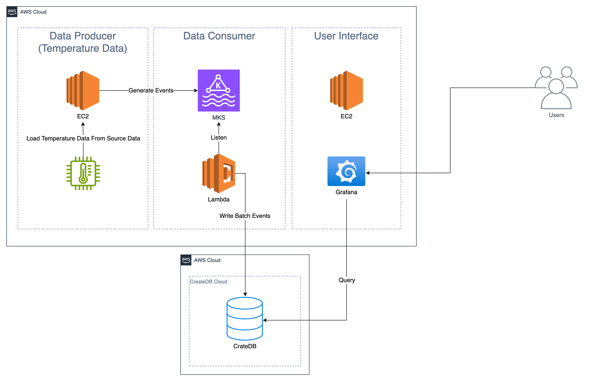

# Real-Time Demo

A demo of CrateDB's real-time analytics capabilities.

## Architecture Overview



The solution consists of three major layers running in the AWS Cloud:

### Data Producer (Temperature Data)
**Purpose:** Simulate and send temperature data events into the system.

- **AWS EC2**
  Hosts a lightweight data generator script that loads temperature readings from a source dataset.
  These readings are serialized into JSON events.

- **Event Stream (Amazon MSK / Kafka)**
  The producer publishes these temperature events to a Kafka topic.
  Kafka provides scalable, fault-tolerant buffering between producers and consumers.

**Flow:**
`EC2 → Kafka (MSK)`


### Data Consumer
**Purpose:** Listen for new temperature events, process them, and write batches into CrateDB.

- **AWS Lambda**
  Subscribes to the Kafka topic and triggers upon new events.
  Processes messages and groups them into batches.

- **CrateDB Cloud**
  The Lambda function writes the processed temperature data into **CrateDB**

**Flow:**
`Kafka → Lambda → CrateDB`


### User Interface
**Purpose:** Visualize the temperature data in real time.

- **AWS EC2 (Frontend Host)**
  Runs a **Grafana** instance, accessible to users via a browser.

- **Grafana Dashboard**
  Connects directly to CrateDB using its PostgreSQL endpoint.
  Executes queries to fetch and visualize temperature metrics such as:
  - Current and historical readings
  - Geo/time-based charts

- **Users**
  Access the Grafana dashboard through a secure web interface.

**Flow:**
`CrateDB → Grafana → Users`


## Data Producer

We use publicly available data from the [Climate Data Store](https://cds.climate.copernicus.eu/). The [ERA5-Land](https://cds.climate.copernicus.eu/datasets/derived-era5-land-daily-statistics?tab=overview) data set includes atmospheric variables, such as air temperature and air humidity from around the globe.

[data/parser.py](data/parser.py) generates a report for a given date range, parses the retrieved NetCDF file, and converts it to JSON documents. Below is an example of the final JSON document.

```json
{
    "timestamp": 1756684800000000000,
    "temperature": 295.6215515136719,
    "latitude": 40.90000000000115,
    "longitude": 31.100000000000172
}
```

### Prerequisites

#### Climate Data Store API

We retrieve data from the Climate Data Store API and you will need access to their API. Please retrieve your personal [CDSAPI key](https://cds.climate.copernicus.eu/how-to-api) and store it in `~/.cdsapirc`:

```shell
echo "url: https://cds.climate.copernicus.eu/api
key: INSERT-YOUR-KEY" > ~/.cdsapirc
```

#### AWS

We use Amazon Managed Streaming for Apache Kafka (MSK). Please set up credentials using [aws configure](https://docs.aws.amazon.com/cli/v1/userguide/cli-configure-files.html#cli-configure-files-methods).

#### Producer

To run the producer, we need to set up a virtual Python environment and install dependencies:

```shell
cd data
python3 -m venv .venv
source .venv/bin/activate
pip3 install -U -r requirements.txt
```

Next, copy the example `.env` file and adjust values as needed:

```bash
cp .env.example .env
```

### Execution

To run the producer, simply execute it. If you want to adjust the date range that will be downloaded, please edit the `main` method accordingly.

```bash
python3 producer.py
```

## Trigger

The trigger is configured to fire on a single new Kafka (MSK) record (batch size 1). To restart the ingest from the start, delete the existing trigger and create a new one (it's very straightforward). There is only one option for MSK cluster, make sure authentication is set and to ignore bad test data, set the starting point to be the timestamp 2025-10-14T00:00:00.000Z. Set the topic to dev-1 (or a different topic as needed).

## Development

This repository uses [black](https://github.com/psf/black) for consistent formatting of Python code. Please check your code before comitting. To set up `black`, run these steps within your virtual Python environment:

```shell
cd data
pip3 install -U -r requirements-dev.txt
black .
```
